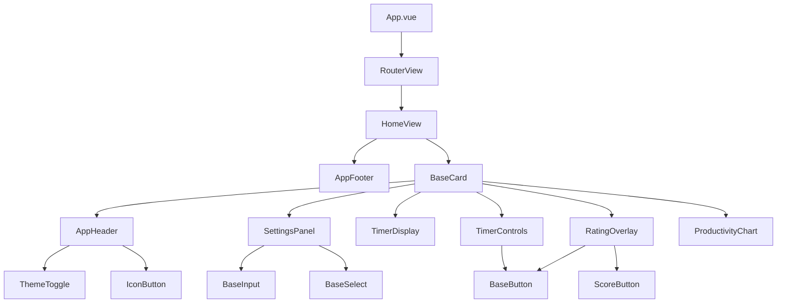
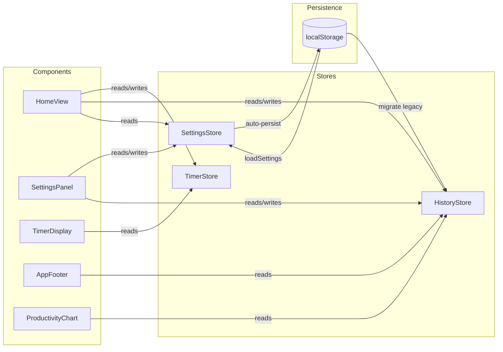
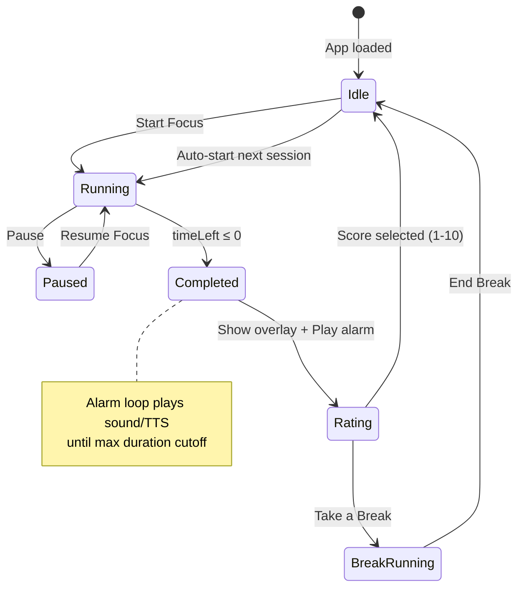
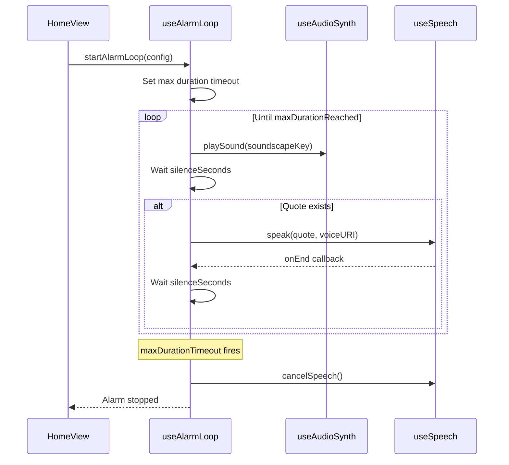
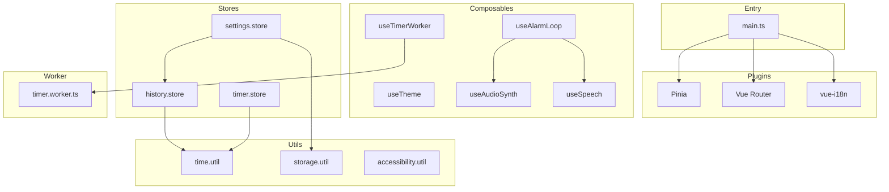
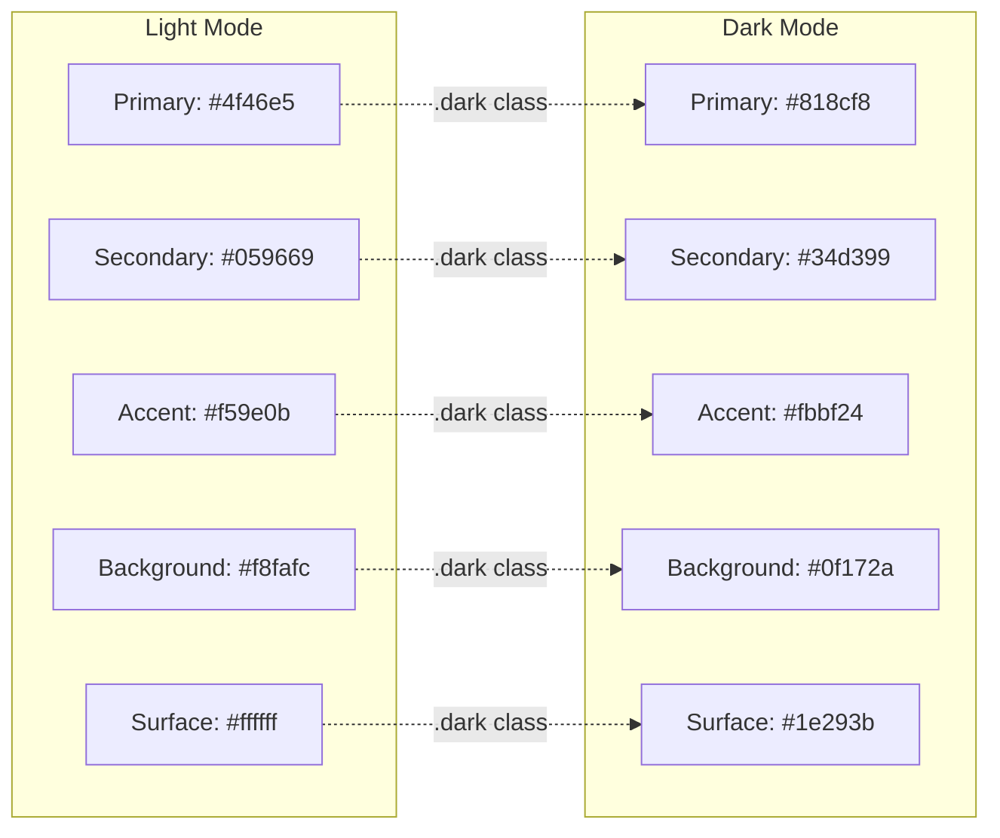

# MicroFocus Architecture

> Auto-generated architecture documentation. Update this file whenever a module or flow changes.

## Component Tree

## Store Data Flow

## Timer Lifecycle

## Alarm Loop Sequence

## Module Dependencies

## Design System Tokens

